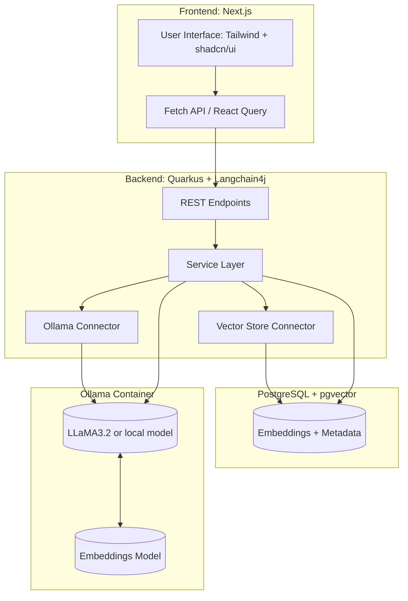
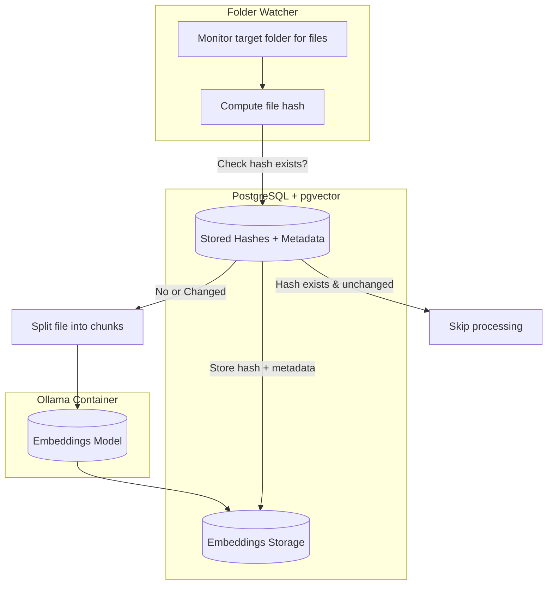

# ai-file-search

## 🏗️ System Architecture

```mermaid
flowchart TD

    subgraph Frontend [Frontend: Next.js]
        UI[User Interface: Tailwind + shadcn/ui]
        FEAPI[Fetch API / React Query]
        UI --> FEAPI
    end

    subgraph Backend [Backend: Quarkus + Langchain4j]
        API[REST Endpoints]
        Service[Service Layer]
        Vector[Vector Store Connector]
        LLM[Ollama Connector]
        
        API --> Service
        Service --> Vector
        Service --> LLM
    end

    subgraph Database [PostgreSQL + pgvector]
        PG[(Embeddings + Metadata)]
    end

    subgraph AI [Ollama Container]
        Model[(LLaMA3.2 or local model)]
        Embed[(Embeddings Model)]
        Model <---> Embed
    end

    %% Connections
    FEAPI --> API
    Vector --> PG
    LLM --> Model
    Service --> PG
    Service --> Model
```

## 📂 File Watch & Ingestion Workflow

```mermaid
flowchart TD

    subgraph Watcher [Folder Watcher]
        FW[Monitor target folder for files]
        Hash[Compute file hash]
    end

    subgraph DB [PostgreSQL + pgvector]
        Meta[(Stored Hashes + Metadata)]
        Vectors[(Embeddings Storage)]
    end

    subgraph AI [Ollama Container]
        EmbedModel[(Embeddings Model)]
    end

    FW --> Hash
    Hash -->|Check hash exists?| Meta
    Meta -->|No or Changed| Chunk[Split file into chunks]
    Chunk --> EmbedModel
    EmbedModel --> Vectors
    Meta <-- Store hash + metadata --- Vectors

    Meta -->|Hash exists & unchanged| Skip[Skip processing]
```