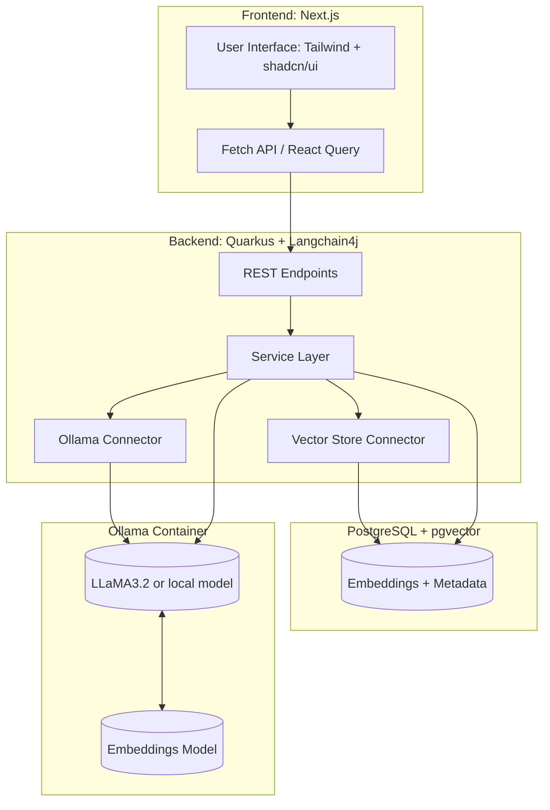
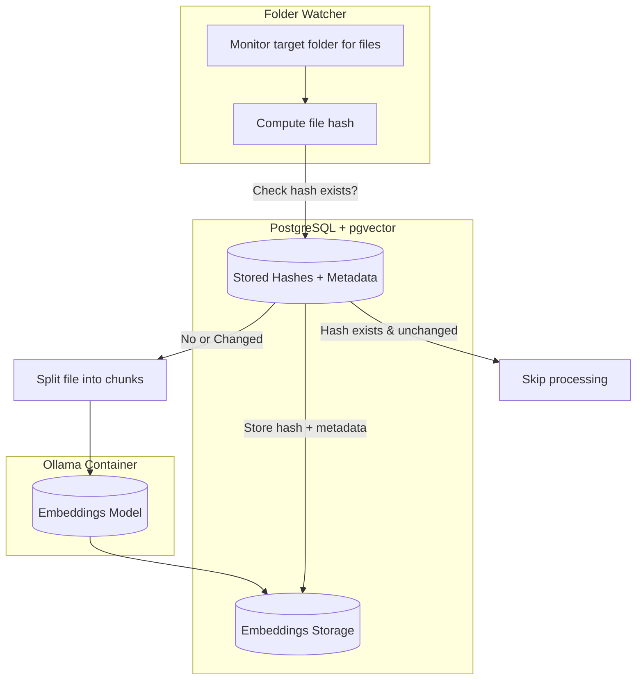

<p align="center">
    
</p>

# Quanta (ai-file-search)

For a very detailed explanation about this repository, check out
the [live coding sessions on YouTube](https://www.youtube.com/playlist?list=PLiY7ZRy4r3yYG-MiSm1JrSfVf-OkUozDS).

## 🏗️ System Architecture



## 📂 File Watch & Ingestion Workflow



## 🚀 Quick start

All you need to start the whole system (it will compile the Java backend and the Next.js frontend and start all required services) is:

```powershell
docker compose up
```

This will build and run the backend, frontend, database, and the Ollama service defined in `docker-compose.yml`.

If you're actively developing the backend and want to start the other services without building or running the backend container, use the development shortcut:

```powershell
docker compose up --scale backend=0
```

This brings up the database, frontend, and Ollama containers while leaving the backend scaled down so you can run the backend locally from your IDE instead of inside Docker.

## 🔎 Purpose

Quanta (ai-file-search) is a local-first document search and retrieval system that:

- Watches a configured folder for new/changed files.
- Chunks documents, computes embeddings, and stores vectors + metadata in PostgreSQL (with pgvector).
- Exposes a REST API (Quarkus + Langchain4j) used by a Next.js frontend to perform semantic search and interactive queries.
- Runs a local LLM and embedding model inside an Ollama container so the stack can work without cloud services.

This repository contains the full-stack pieces (frontend, backend, database, and an Ollama container) and example init scripts for local use.

## 📌 Current status

- Backend: Quarkus-based service with watch/ingest, vector connector, and Ollama integration — actively maintained.
- Frontend: Next.js app (app router) with a minimal UI to perform searches and display results.
- Database: PostgreSQL with pgvector. Example data/init scripts are in `db/`.
- AI: Local Ollama container orchestrated through Docker compose; swap-in external models if desired.

Status: development — the core features (ingestion, embedding, vector storage, query) are implemented. Expect ongoing improvements and occasional breaking changes on the `main` branch.

## 📁 What you'll find in this repo

- `backend/` — Quarkus Java service, Docker build files, Maven wrapper.
- `frontend/` — Next.js application, Tailwind and shadcn/ui usage, example pages.
- `db/` — Dockerfile and init SQL for PostgreSQL / pgvector.
- `ollama/` — Ollama data and run scripts used by the local model container.
- `resources/demo-files/` — Sample files (sci-fi / medieval) you can use to test ingestion.

## 🛠️ Local development (recommended)

The project is designed to be runnable with Docker Compose for a quick start, or you can run components locally during development.

### Backend (Quarkus) — run from your IDE

1. Build & run locally (uses the project `mvnw` wrapper):

```powershell
cd backend
./mvnw quarkus:dev
```

2. When running locally you can start the rest of the stack without the backend container:

```powershell
docker compose up --scale backend=0
```

This starts PostgreSQL, Ollama, and the frontend. The backend running on `localhost:8080` will be used by the frontend.

### Frontend (Next.js)

1. Install dependencies and run the dev server:

```powershell
cd frontend
npm install
npm run dev
```

2. The Next.js app runs at `http://localhost:3000` by default and will call the backend API (CORS set in backend configuration).

### Database

The `db/` folder includes a Dockerfile and initialization SQL; `docker compose up` will create a Postgres container and initialize the sample pgvector extension and any migration scripts provided.

## 🐳 Docker Compose notes

- Quick start (builds and runs everything):

```powershell
docker compose up --build
```

- Scale down the backend to work on it locally:

```powershell
docker compose up --scale backend=0
```

- If you change models or Ollama settings, rebuild or restart the Ollama service to pick up configuration changes.

## ⚙️ Environment variables

The services read environment variables from the compose file and the container environments. Key values include database connection strings, Ollama host/port, and any API keys you may configure for optional external services.

Check `backend/src/main/resources/application.properties` for backend-specific configuration keys and default values.

## 🚨 Troubleshooting

- Backend fails to start: check `backend/target/*` for logs, and run `./mvnw -X` to get verbose Maven output.
- Postgres connection issues: ensure the DB container is healthy and that `PGHOST`/`PGPORT` in your environment/compose match the backend config.
- Embeddings or model errors: check the Ollama container logs and verify the model artifacts are present in `ollama/models`.

If you hit an issue not covered here, open an issue with the failure logs and steps to reproduce.

## Contributing

Contributions are welcome. If you plan to add features or fix bugs:

1. Open an issue to discuss the change.
2. Create a feature branch from `main`.
3. Provide tests where appropriate (backend unit/integration tests or frontend test additions).
4. Send a pull request referencing the issue.

## License

See the repository root for license details (if none present, assume an open-source-friendly license will be added soon).

---

If you want, I can also:

- Add a short `DEVELOPMENT.md` that collects the commands above as copy-paste snippets.
- Add a troubleshooting section that includes common `docker` / `psql` commands to inspect containers and DB state.

Tell me which extras you'd like and I'll add them.