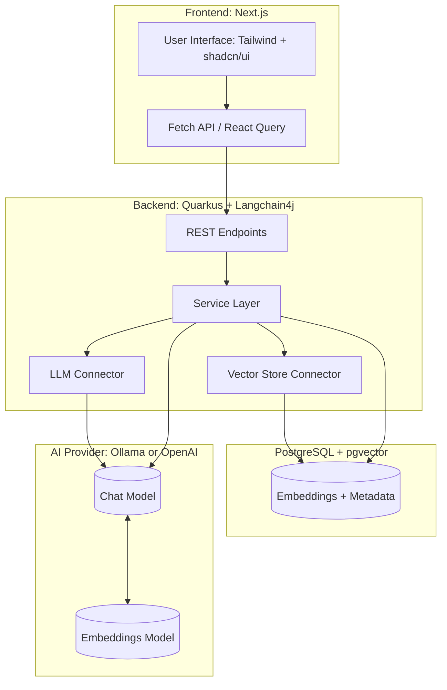
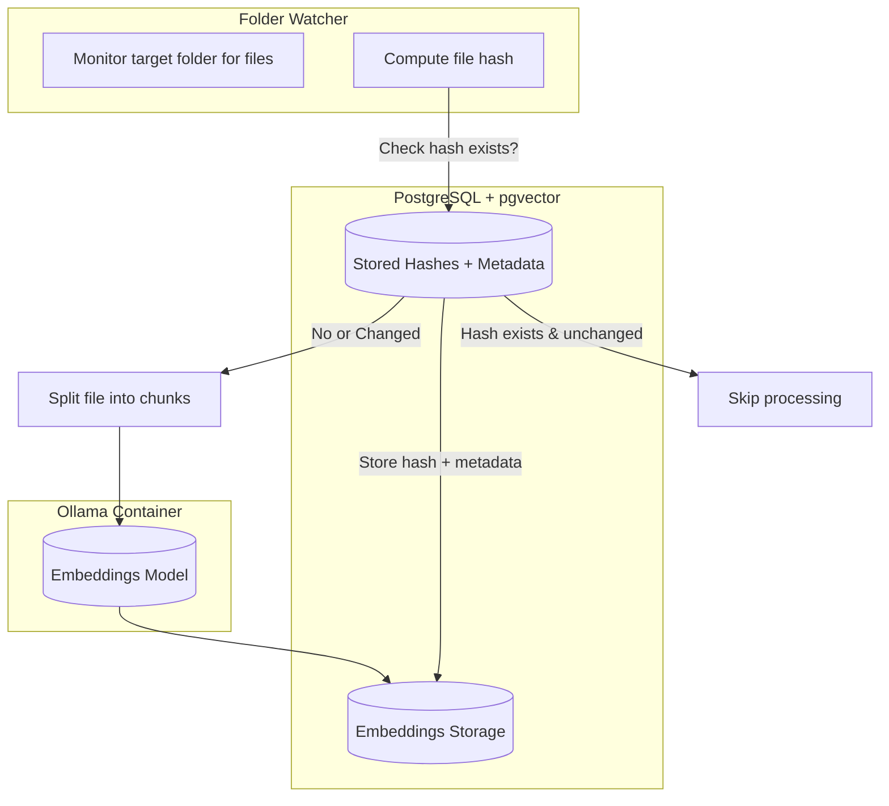

<p align="center">
    
</p>

# Quanta (ai-file-search)

For a very detailed explanation about this repository, check out
the [live coding sessions on YouTube](https://www.youtube.com/playlist?list=PLiY7ZRy4r3yYG-MiSm1JrSfVf-OkUozDS).

## 🏗️ System Architecture


```mermaid
flowchart TD

    subgraph Frontend [Frontend: Next.js]
        UI[User Interface: Tailwind + shadcn/ui]
        FEAPI[Fetch API / React Query]
        UI --> FEAPI
    end

    subgraph Backend [Backend: Quarkus + Langchain4j]
        API[REST Endpoints]
        Service[Service Layer]
        Vector[Vector Store Connector]
        LLM[LLM Connector]
        
        API --> Service
        Service --> Vector
        Service --> LLM
    end

    subgraph Database [PostgreSQL + pgvector]
        PG[(Embeddings + Metadata)]
    end

    subgraph AI [AI Provider: Ollama or OpenAI]
        Model[(Chat Model)]
        Embed[(Embeddings Model)]
        Model <---> Embed
    end

    %% Connections
    FEAPI --> API
    Vector --> PG
    LLM --> Model
    Service --> PG
    Service --> Model
```

## 📂 File Watch & Ingestion Workflow


```mermaid
flowchart TD

    subgraph Watcher [Folder Watcher]
        FW[Monitor target folder for files]
        Hash[Compute file hash]
    end

    subgraph DB [PostgreSQL + pgvector]
        Meta[(Stored Hashes + Metadata)]
        Vectors[(Embeddings Storage)]
    end

    subgraph AI [Ollama Container]
        EmbedModel[(Embeddings Model)]
    end
    Hash -->|Check hash exists?| Meta
    Meta -->|No or Changed| Chunk[Split file into chunks]
    Chunk --> EmbedModel
    EmbedModel --> Vectors
    Meta <-- Store hash + metadata --- Vectors

    Meta -->|Hash exists & unchanged| Skip[Skip processing]
```

## 🚀 Quick start

The system supports two AI providers: **Ollama** (local models, no API key needed) and **OpenAI**.
A base `docker-compose.yml` holds the shared services (db, backend, frontend); provider-specific
overrides add the rest.

### With Ollama (local models)

```powershell
docker compose -f docker-compose.yml -f docker-compose.ollama.yml up
```

Starts the backend, frontend, database, and a local Ollama container with the configured models.

### With OpenAI

Make sure `OPENAI_API_KEY` is set in your shell, then:

```powershell
docker compose -f docker-compose.yml -f docker-compose.openai.yml up
```

No Ollama container is started. The backend uses `gpt-4o-mini` for chat and `text-embedding-3-small` for embeddings.

> ⚠️ Switching providers clears the vector store (different embedding dimensions). Re-ingestion happens automatically on the next startup.

If you're actively developing the backend and want to start the other services without building or running the backend container, add `--scale backend=0`:

```powershell
# Example for Ollama profile
docker compose -f docker-compose.yml -f docker-compose.ollama.yml up --scale backend=0
```

## 🔎 Purpose

Quanta (ai-file-search) is a local-first document search and retrieval system that:

- Watches a configured folder for new/changed files.
- Chunks documents, computes embeddings, and stores vectors + metadata in PostgreSQL (with pgvector).
- Exposes a REST API (Quarkus + Langchain4j) used by a Next.js frontend to perform semantic search and interactive queries.
- Supports **Ollama** (local models, fully offline) and **OpenAI** as interchangeable AI providers.

This repository contains the full-stack pieces (frontend, backend, database, and an Ollama container) and example init scripts for local use.

## 📌 Current status

- Backend: Quarkus-based service with watch/ingest, vector connector, and Langchain4j integration — actively maintained.
- Frontend: Next.js app (app router) with a minimal UI to perform searches and display results.
- Database: PostgreSQL with pgvector. Example data/init scripts are in `db/`.
- AI: Ollama (local container) or OpenAI — switchable via Docker Compose overlay or Quarkus profile.

Status: development — the core features (ingestion, embedding, vector storage, query) are implemented. Expect ongoing improvements and occasional breaking changes on the `main` branch.

## 📁 What you'll find in this repo

- `backend/` — Quarkus Java service, Docker build files, Maven wrapper.
- `frontend/` — Next.js application, Tailwind and shadcn/ui usage, example pages.
- `db/` — Dockerfile and init SQL for PostgreSQL / pgvector.
- `ollama/` — Ollama data and run scripts used by the local model container.
- `resources/demo-files/` — Sample files (sci-fi / medieval) you can use to test ingestion.

## 🛠️ Local development (recommended)

The project is designed to be runnable with Docker Compose for a quick start, or you can run components locally during development.

### Backend (Quarkus) — run from your IDE

1. Build & run locally with Ollama (default):

```powershell
cd backend
./mvnw quarkus:dev
```

Or with OpenAI (make sure `OPENAI_API_KEY` is set):

```powershell
cd backend
./mvnw quarkus:dev -Dquarkus.profile=openai
```

2. When running locally you can start the rest of the stack without the backend container:

```powershell
# Ollama
docker compose -f docker-compose.yml -f docker-compose.ollama.yml up --scale backend=0

# OpenAI (no Ollama container needed)
docker compose -f docker-compose.yml -f docker-compose.openai.yml up --scale backend=0
```

### Frontend (Next.js)

1. Install dependencies and run the dev server:

```powershell
cd frontend
npm install
npm run dev
```

2. The Next.js app runs at `http://localhost:3000` by default and will call the backend API (CORS set in backend configuration).

### Database

The `db/` folder includes a Dockerfile and initialization SQL; `docker compose up` will create a Postgres container and initialize the sample pgvector extension and any migration scripts provided.

## 🐳 Docker Compose notes

| Command | Provider |
|---|---|
| `docker compose -f docker-compose.yml -f docker-compose.ollama.yml up` | Ollama (local) |
| `docker compose -f docker-compose.yml -f docker-compose.openai.yml up` | OpenAI |

- Add `--build` to rebuild images after code changes.
- Add `--scale backend=0` to skip the backend container and run it locally instead.
- If you change models or Ollama settings, restart the Ollama service to pick up configuration changes.

## ⚙️ Environment variables

| Variable | Used by | Description |
|---|---|---|
| `OPENAI_API_KEY` | Backend (OpenAI profile) | Your OpenAI API key |
| `QUARKUS_PROFILE` | Backend | Set to `openai` to use OpenAI; omit for Ollama (default) |

All other configuration (DB connection, Ollama URL, model names) is handled via `docker-compose.*.yml` overlays or `backend/src/main/resources/application.properties`.

## 🚨 Troubleshooting

- Backend fails to start: check `backend/target/*` for logs, and run `./mvnw -X` to get verbose Maven output.
- Postgres connection issues: ensure the DB container is healthy and that `PGHOST`/`PGPORT` in your environment/compose match the backend config.
- Embeddings or model errors: check the Ollama container logs and verify the model artifacts are present in `ollama/models`.

If you hit an issue not covered here, open an issue with the failure logs and steps to reproduce.

## Contributing

Contributions are welcome. If you plan to add features or fix bugs:

1. Open an issue to discuss the change.
2. Create a feature branch from `main`.
3. Provide tests where appropriate (backend unit/integration tests or frontend test additions).
4. Send a pull request referencing the issue.

## License

See the repository root for license details (if none present, assume an open-source-friendly license will be added soon).