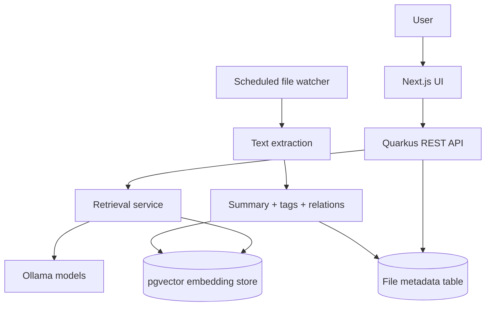

# Quanta Product Specification

## 1. Product summary

Quanta is a local-first semantic file discovery application. It watches a configured folder, extracts document text, enriches documents with AI-generated summaries and tags, stores embeddings and metadata in PostgreSQL with pgvector, and exposes a search UI for finding files by meaning instead of only exact keywords.

The product is designed for individuals or small teams who want a private knowledge retrieval layer on top of local files without depending on cloud-hosted LLM infrastructure.

## 2. Product goals

### Primary goals

1. Make local documents easy to discover through semantic search.
2. Turn raw files into usable knowledge objects with summaries, tags, and related topics.
3. Keep the full workflow local-first and understandable to self-host.
4. Provide a lightweight interface that is fast, clear, and reliable on desktop and mobile.
5. Preserve indexed knowledge across restarts unless the user intentionally resets the system.

### Secondary goals

1. Allow users to refine or correct AI-generated tags.
2. Support a wide range of file formats through Apache Tika extraction.
3. Keep the architecture simple enough for contributors to extend.

### Non-goals

1. Multi-user permissions and tenant isolation.
2. Cloud synchronization or external document storage.
3. Complex enterprise document workflows such as approvals or version reviews.
4. Advanced analytics dashboards.

## 3. Target users

| User | Needs | Success signal |
| --- | --- | --- |
| Solo knowledge worker | Find a relevant document quickly from natural language | Finds the right file in seconds |
| Researcher or student | Search notes, PDFs, and references by concept | Retrieves related sources without remembering exact filenames |
| Developer or operator | Inspect indexed files and edit tags | Improves metadata quality with minimal friction |
| Self-hosting enthusiast | Run the full stack locally | Starts and maintains the system without hidden dependencies |

## 4. User problems

1. Filenames alone are a poor retrieval surface for large local collections.
2. Local folders often contain mixed formats and inconsistent naming.
3. Users may remember a concept or topic, not the exact document name.
4. AI-generated metadata needs lightweight human correction to stay useful.
5. A minimal search tool becomes frustrating if it loses state, duplicates requests, or hides details on smaller screens.

## 5. Core use cases

### UC1: Semantic search for a document

**Actor:** End user

**Trigger:** The user enters a natural-language query such as "annual finance report" or "notes about distributed systems".

**Main flow**

1. User enters a search query.
2. Frontend calls the backend search endpoint.
3. Backend generates an embedding for the query.
4. Vector store returns the nearest indexed documents.
5. Backend maps matching metadata into API results.
6. Frontend displays the ranked result list and a detail panel for the selected result.

**Success outcome:** The user finds the target document or a useful shortlist quickly.

### UC2: Discover files through tags

**Actor:** End user

**Trigger:** The user clicks a tag from a result or searches directly by tag.

**Main flow**

1. User selects a tag.
2. Frontend updates the URL state and requests a tag search.
3. Backend finds documents whose normalized tag set contains the requested tag.
4. Frontend shows matching files and selects the first result by default.

**Success outcome:** The user pivots from one relevant file into a broader topic cluster.

### UC3: Review document metadata

**Actor:** End user

**Trigger:** The user selects a result.

**Main flow**

1. Frontend opens the file details view.
2. User sees summary, path, tags, related topics, and last modified time.
3. On desktop the details appear in a side panel; on mobile they appear inline below the results.

**Success outcome:** The user can evaluate file relevance without opening the file externally.

### UC4: Correct or improve tags

**Actor:** End user

**Trigger:** The user edits tags for a selected file.

**Main flow**

1. User opens tag editing.
2. Frontend normalizes the comma-separated input.
3. Backend persists normalized tags for the document.
4. Updated tags appear immediately in the UI.

**Success outcome:** Metadata quality improves over time with little effort.

### UC5: Automatic ingestion of changed files

**Actor:** System

**Trigger:** The scheduled watcher scans the configured folder.

**Main flow**

1. Backend walks the configured filesystem path.
2. Each file is compared using last modified time.
3. New or changed files are re-extracted.
4. AI services create summary, tags, relations, and embeddings.
5. Metadata and vectors are updated in persistence.

**Success outcome:** Search stays aligned with the underlying folder contents.

## 6. Functional requirements

### Ingestion and indexing

1. The system must scan a configured root folder on a schedule.
2. The system must extract text from supported file formats using Apache Tika.
3. The system must skip empty content for embedding generation.
4. The system must generate:
   1. a short summary,
   2. a normalized tag list,
   3. related topics,
   4. a vector embedding.
5. The system must persist document metadata keyed by absolute file path.
6. The system should preserve indexed metadata between application restarts.

### Search API

1. The system must expose semantic file search by prompt.
2. The system must expose tag-based search.
3. The system must expose tag updates for an existing indexed file.
4. The API must reject blank search inputs with clear client errors.
5. The API must return not found when tag updates target a missing file.
6. Search responses must include:
   1. file name,
   2. absolute path,
   3. last modified timestamp,
   4. summary,
   5. tags,
   6. related topics.

### Frontend experience

1. The search screen must support URL-backed query state for reloads and sharing.
2. The UI must avoid duplicate requests when the same search state is replayed from the URL.
3. The UI must show loading feedback during active requests.
4. The UI must show a clear error state when requests fail.
5. The UI must automatically select a useful default result when results exist.
6. The UI must let users inspect metadata on mobile as well as desktop.
7. The UI must allow editing tags without leaving the page.

## 7. Non-functional requirements

### Reliability

1. Startup should not destroy prior indexed metadata by default.
2. Invalid user input should fail explicitly, not silently.
3. The UI should remain stable when searches are triggered quickly in succession.

### Maintainability

1. API contracts should match actual frontend needs.
2. Metadata normalization should happen in one place.
3. UI state should be explicit and easy to trace.

### Performance

1. Search requests should feel immediate for normal local datasets.
2. Duplicate searches should be avoided.
3. Result rendering should remain lightweight and scroll-friendly.

### Privacy

1. The primary deployment mode should remain local-first.
2. Document content should stay within local infrastructure unless the operator explicitly changes providers.

## 8. UX principles

1. **Show progress clearly.** Searches should always communicate whether the system is busy.
2. **Fail visibly.** Errors should be presented in the interface, not only in console logs.
3. **Preserve context.** URL state, current selection, and editable metadata should remain coherent.
4. **Prefer useful defaults.** Selecting the first result is better than showing an empty details pane.
5. **Design for smaller screens.** Critical details must remain accessible on mobile.

## 9. Current architecture

## 10. Key quality gaps found during analysis

1. The frontend could issue duplicate requests when URL state and manual search actions both triggered the same fetch.
2. Search failures were only logged to the console, leaving users without feedback.
3. The mobile layout hid document details entirely.
4. The UI expected metadata fields that were not meaningfully populated.
5. Backend endpoints accepted invalid input or silently ignored missing update targets.
6. The default backend schema strategy recreated the database on startup, risking indexed data loss.

## 11. Improvements implemented from this specification

1. Added backend validation for blank prompt, tag, and path inputs.
2. Returned 404 for tag updates against unknown files instead of silently succeeding.
3. Normalized stored tag and relation lists for cleaner metadata.
4. Returned a real file name and last modified timestamp in search responses.
5. Switched schema management from destructive recreation to update mode.
6. Added frontend error states and loading-aware controls.
7. Prevented duplicate search requests caused by URL synchronization.
8. Auto-selected the first result to reduce empty-state friction.
9. Added a mobile-friendly metadata view.
10. Removed misleading empty metadata from the UI and aligned the frontend type with the backend contract.

## 12. Future enhancements

1. Add excerpt or highlighted chunk previews for each result.
2. Store and display file size and content type explicitly.
3. Add ingestion status visibility in the UI.
4. Add document opening or filesystem handoff actions.
5. Improve exact-tag storage with a normalized relational model if the dataset grows substantially.
